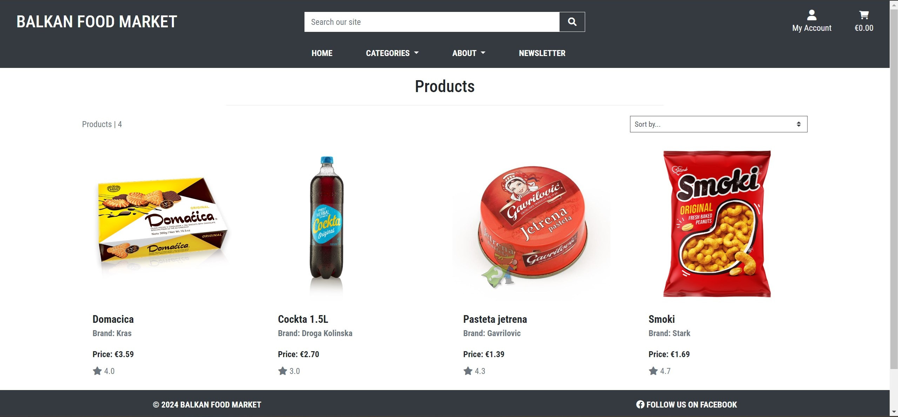

# Balkan Food Market

**This is a Django-based e-commerce project**



***[Live website](https://balkan-food-market-90ac941cd27b.herokuapp.com/)*** created by **Dino Cigic**.

***

## Table of Contents

- [User experience](#user-experience)
    - [Project goals](#project-goals)
    - [User stories](#user-stories)
- [Design](#design)
    - [Colours](#colours)
    - [Typography](#typography)
- [Features](#features)
    - [Existing features](#existing-features)
    - [Features left to implement](#features-left-to-implement)
- [Business Model](#business-model)
- [Web Marketing](#web-marketing)
    - [Newsletter](#newsletter)
    - [Facebook](#facebook)
- [Technologies Used](#technologies-used)
- [Agile Development Process](#agile-development-process)
- [Setup](#setup)
- [Deployment](#deployment)
    - [Heroku](#heroku)
- [Testing](#testing)
    - [Validation](#validation)
    - [Manual Testing](#manual-testing)
        - [Account Registration](#account-registration)
        - [Navigation](#navigation)
        - [Checkout](#pcheckout)
        - [CRUD](#crud)
        - [Subscription](#subscription)
- [Credits](#credits)
    - [Content](#content)
    - [Images](#images)
    - [Code](#code)
- [Acknowledgements](#acknowledgements)

## User experience

### Project goals
- Project goal was to create e-commerce application for all people from Balkans in Ireland and everyone interested to try balkan food.

### User stories

- As a Site User I can register an account so that I can interact with the site content.
- As a Site user I can login to the site so that I can access my account.
- As a Site user I can logout from the site so that my account is kept secure.
- As a shopper I can navigate around the site so that I can easily view the desired content.
- As a shopper I want to view a list of products so that I can select some to purchase.
- As a shopper I want to view individual product details so that I can view the product image, price, description and product rating.
- As a shopper I can search for a product by name or description so that I can find a specific product I'd like to purchase.
- As a shopper I can choose product categories so that I can easier find relevant products.
- As a shopper I can sort the products so that I can easily find desired product based on price, ratings, category or title.
- As a shopper I want to view items in my cart so that I can identify the total cost of my purchase and all items I will receive.
- As a shopper I want to easily view the cost of my shopping cart at any time so that I can avoid spending too much.
- As a shopper I can add products to my shopping cart so that I can make my purchase.
- As a shopper I can update quantity of the products in my cart so that I can make changes before I checkout.
- As a shopper, I want to easily enter my payment information so that I can check out quickly and with little hassle.
- As a shopper, I want to easily enter my payment information so that I can check out quickly and with little hassle.
- As a shopper I can view confirmation of my purchase so that I can verify that I haven't made any mistakes.
- As a shopper I want to feel my personal and payment information is safe and secure so that I can confidently provide the needed information to make a purchase.
- As a site user I want to have a personalized user profile so that I can view my personal order history and save my payment information.
- As a store owner I can add a product so that I can update my inventory.
- As a store owner I can edit a product so that I can change product prices, descriptions, images and other product informations.
- As a store owner I can delete a product so that I can remove products that are no longer for sale.
- As a shopper I can rate the products I bought so that I can give my feedback.
- As a shopper I can sign up for a newsletter so that I can keep up to date with new products and promotions.

## Design

### Colours
Used only white color and Bootstrap's dark class.

### Typography
In this project I used google's font ***Roboto Condensed***.


## Features

### Existing features

- Account registration, login and logout.
- View of all products on the homepage.
- Option to view products by category.
- Option to search site.
- Option to sort products by price, rating, name, and category.
- Detailed view of each product.
- Option to rate products and remove ratings for registered users.
- Option add products in cart, update them and remove.
- Option to buy products with secure payment.
- Option to subscribe to newsletter.
- Option to save informations in user's profile.
- Option to add, edit and delete products for store owner.
- Option to add, edit and delete faqs for store owner.
- Option to add, edit and delete about us content for store owner.
- Option to hide from customers products out of stock and disable option to add them to shopping cart.

### Features left to implement

- Email confirmation for orders and registration.


## Business Model

The business model for this store would be a B2C (Business to Customer) model, as the business would be selling products directly to the customer.


## Web Marketing

### Newsletter

I used Mailchimp to create newsletter for users to subscribe. The Page owner can send content to the subscribers.

### Facebook

Balkan Food Market use [facebook](https://www.facebook.com/profile.php?id=61558615940125/) for marketing purposes to post adverts and relevant content for users to engage.


## Technologies Used
- Python
- Django
- PostgreSQL
- HTML
- CSS
- Javascript
- Bootstrap 4
- [Elephant SQL](https://www.elephantsql.com/)
- [AWS](https://aws.amazon.com/)
- [Heroku](https://heroku.com/)
- [Mailchimp](https://mailchimp.com/)
- [Stripe](https://stripe.com/)
- [Git](https://git-scm.com/)
- [Github](https://github.com/)
- [Visual Studio Code](https://code.visualstudio.com/)
- [W3Schools](https://www.w3schools.com/)
- [Stack Overflow](https://stackoverflow.com/)


## Agile Development Process

I followed Agile methodology for this project, fostering flexibility and regular progress updates. This approach allowed me to deliver increments efficiently. I used Github Kanban board for this project and created Kanban board with four columns: "To Do" "In Progress" "Done" and "Left to implement". Project contains 23 user stories. Link to project's user stories [here](https://github.com/users/dcigic92/projects/6).


## Setup

1. **Clone the repository:**

   ```bash
   git clone git@github.com:dcigic92/pp5-balkan-food-market.git
   ```

2. **Install dependencies:**

   ```bash
   pip3 install -r requirements.txt
   ```

3. **Generate migrations:**

   ```bash
   python3 manage.py makemigrrations
   ```

4. **Apply migrations:**

   ```bash
   python3 manage.py migrate
   ```

5. **Create a superuser:**

   ```bash
   python3 manage.py createsuperuser
   ```

   Follow the prompts to create an admin account.

6. **Run the development server:**

   ```bash
   python3 manage.py runserver
   ```

   The project should now be accessible at http://127.0.0.1:8000/.


## Deployment

### Heroku:

1. **Create Heroku App:**
   - Create a new Heroku app and link it to the Git repository for the project.

2. **Heroku Configurations:**
   - In Heroku's settings set up config vars such as the Database URL, Cloudinary URL and the Secret Key.

3. **Deployment:**
   - Deploy the project to Heroku by pushing the code to the Heroku remote repository, set Debug=False before final deployment.


## Testing

### Validation

- CSS validated with [W3C CSS Validator](https://jigsaw.w3.org/css-validator/).
- HTML validated with [W3C HTML5 Validator](https://validator.w3.org/).
- JavaScript was tested with [JSHint](https://jshint.com/).
- Python has been validated using the [PEP8 Python Checker](https://www.pythonchecker.com/).

### Manual Testing

#### Account Registration
| Test |Result |
|--|--|
| User can register an account|Pass|
| User can log in|Pass|
| User can log out|Pass|
---

#### Navigation
| Test |Result |
|--|--|
|User can choose by categories|Pass|
|User can use search bar|Pass|
|User can open about us page|Pass|
|User can open faqs page|Pass|
|User can open open newsletter page|Pass|
|User can open open home page|Pass|
|User can open open my account|Pass|
|User can open open cart|Pass|
---

#### Checkout
| Test |Result |
|--|--|
|User can process order|Pass|
|User can save informations from checkout form|Pass|
|User can see processed orders in profile history|Pass|
---

#### CRUD
| Test |Result |
|--|--|
|User can view products|Pass|
|User can rate products|Pass|
|User can remove ratings|Pass|
|User can add products to cart|Pass|
|User can view products in cart|Pass|
|User can update products in cart|Pass|
|User can remove products from cart|Pass|
|SuperUser can view products|Pass|
|SuperUser can add product|Pass|
|SuperUser can edit product|Pass|
|SuperUser can delete product|Pass|
|SuperUser can view about us content|Pass|
|SuperUser can create about us content|Pass|
|SuperUser can edit about us content|Pass|
|SuperUser can delete about us content|Pass|
|SuperUser can view faqs|Pass|
|SuperUser can create faq|Pass|
|SuperUser can edit faq|Pass|
|SuperUser can delete faq|Pass|
---

#### Subscription
| Test |Result |
|--|--|
|User can subscribe to newsletter|Pass|
---


## Credits

### Content

- Text for about page taken from [Adriatic](https://adriatictaste.ie/) and edited.

### Images 

- [Smoki](https://smoki.rs/wp-content/uploads/2021/02/Smoki_Original150g@2x.png)
- [Cockta](https://images.squarespace-cdn.com/content/v1/603a9ae925c288203141fbe2/1615809956925-F7JXF4SUOW8OK7DYXFIH/08+New+Cockta+1.5+l.jpg?format=1500w)
- [Domacica](https://www.croatianstore.ie/wp-content/uploads/2020/11/Biscuits-Kras-Domacica-Original-300g-1.png)
- [Pasteta](https://stajedem.rs/images/proizvodi/750x750-2139)
- [Tuna](https://fooddepottoronto.com/cdn/shop/products/DelamarisTunaSaladMexicana.png?v=1677972361&width=1206)

### Code
  
- Some parts of the code were inspired by Project Boutique Ado from [Code institute](https://learn.codeinstitute.net/dashboard).


## Acknowledgements

- My mentor **Akshat Garg** for his feedback and advice.
- Our cohort facilitator **Alan Bushell**, our new cohort facilitator **Marko** and slack community.
- My wife and friends for help with testing.